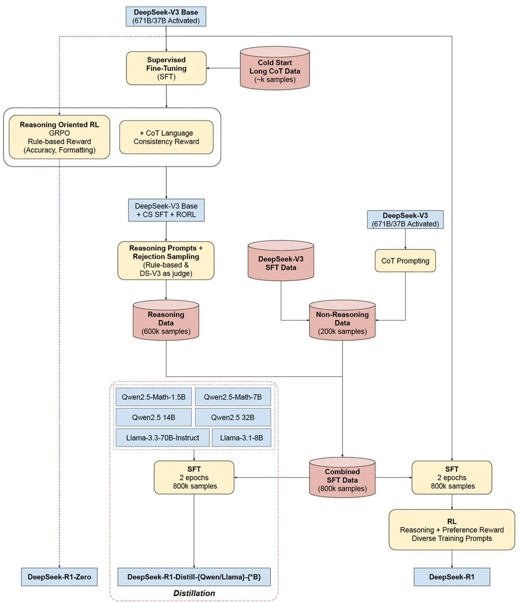

# Awesome-deepseek-r1-resources

- [[🔗 link]](https://github.com/deepseek-ai/DeepSeek-R1) — deepseek-ai/DeepSeek-R1: tech report

## **Reproduction**

- [[🔗 link]](https://github.com/huggingface/open-r1) — huggingface/open-r1: Fully open reproduction of DeepSeek-R1
- [[🔗 link]](https://github.com/Jiayi-Pan/TinyZero) — Jiayi-Pan/TinyZero
- [[🔗 link]](https://github.com/hkust-nlp/simpleRL-reason) — hkust-nlp/simpleRL-reason: This is a replicate of DeepSeek-R1-Zero and DeepSeek-R1 training on small models with limited data

## Related Resources

- [**R1+Sonnet Shatters Benchmark at 14X Lower Cost**](https://aider.chat/2025/01/24/r1-sonnet.html): **DeepSeek R1** paired with **Sonnet** achieved **64%** on the aider polyglot benchmark, outperforming **o1** while costing **14X less**. Users highlighted its MIT license and adoption at top universities.
- [**R1 Re-Distillation Boosts Qwen-1.5B**](https://huggingface.co/mobiuslabsgmbh/DeepSeek-R1-ReDistill-Qwen-1.5B-v1.0): Mobius Labs’ **redistill**ed R1 variant surpassed the original, with plans to expand to other architectures.
- [**R1’s Arena Rankings Spark GPU Allocation Theories**](https://x.com/lmarena_ai/status/1882749951924715578): R1 hit **#3** in LMArena, matching **o1**’s coding performance at **20x cheaper**, fueled by rumors of spare NVIDIA H100 usage and Chinese government backing.
- [[🔗 link]](https://github.com/atfortes/Awesome-LLM-Reasoning?tab=readme-ov-file#toc9) — atfortes/Awesome-LLM-Reasoning: Reasoning in LLMs: Papers and Resources, including Chain-of-Thought, OpenAI o1, and DeepSeek-R1 🍓
- [[🔗 link]](https://www.interconnects.ai/p/deepseek-r1-recipe-for-o1) — Nathan Lambert:  DeepSeek R1's recipe to replicate o1 and the future of reasoning LMs

## Findings

### Launch

When we say "R1", it's ambiguous. DeepSeek actually dropped 8 R1 models - 2 "full" models, and 6 distillations on open models:

- from Qwen 2.5: finetuned with 800k samples curated with DeepSeek-R1, in 1.5B, 7B, 14B, and 32B
- from Llama 3.1 8B Base: DeepSeek-R1-Distill-Llama-8B
- from Llama3.3-70B-Instruct: DeepSeek-R1-Distill-Llama-70B
- and DeepSeek-R1 and DeepSeek-R1-Zero, the full-size, 671B MoE models similar to [DeepSeek V3](https://www.latent.space/p/baseten). Surprisingly, [MIT licensed](https://x.com/deepseek_ai/status/1881318138937233664?s=46) rather than custom licenses, including explicit OK for finetuning and distillation

Other notables from the launch:

- **Pricing** (per million tokens): 14 cents input (cache hit), 55 cents input (cache miss), and 219 cents output. This compares to o1 at 750 cents input (cache hit), 1500 cents input (cache miss), 6000 cents output. **That's 27x-50x cheaper than o1.**
- [solves every problem from the o1 blogpost](https://x.com/mrsiipa/status/1881330071874813963). [every one](https://x.com/nrehiew_/status/1881453058556870934?s=46).
- [can run the distilled models on ollama](https://simonwillison.net/2025/Jan/20/deepseek-r1/)
- can write [manim code](https://x.com/christiancooper/status/1881335734256492605) really well

Surprises from [the paper](https://github.com/deepseek-ai/DeepSeek-R1/blob/main/DeepSeek_R1.pdf):

- The process was:
    1. [V3 Base → R1 Zero](https://x.com/casper_hansen_/status/1881404608591085817) (using GRPO - aka reward for correctness and style outcomes - no fancy PRM/MCTS/RMs)
    2. [R1 Zero → R1 Finetuned Cold Start](https://x.com/casper_hansen_/status/1881404611401236745) (distil long CoT samples from R1 Zero)
    3. [R1 Cold Start → R1 Reasoner with RL](https://x.com/casper_hansen_/status/1881404614190506188) (focus on language consistency - to produce readable reasoning)
    4. [R1 Reasoning → R1 Finetuned-Reasoner](https://x.com/casper_hansen_/status/1881404617235509711) (Generate 600k: multi-response sampling and only keep correct samples (using prev rules) and using V3 as a judge: filter out mixed languages, long paragraphs, and code)
    5. [R1 Instruct-Reasoner → R1 Aligned](https://x.com/casper_hansen_/status/1881404619362013294) (Balance reasoning with helpfulness and harmlessness using GRPO)
- [Visualized](https://x.com/SirrahChan/status/1881488738473357753):
  
    
    
- Supervised data, Process reward models, and [MCTS](https://x.com/lu_sichu/status/1881348105586855962) did -NOT- work

- but they do use [GRPO from DeepSeekMath](https://arxiv.org/abs/2402.03300) ([challenged by the DPO author](https://x.com/rm_rafailov/status/1881350883252085000)) as "the RL framework to improve model performance in reasoning" where reasoning (like [in-context back-tracking](https://x.com/paul_cal/status/1881324020592963939)) "naturally emerged" after "thousands of RL steps" - [not quite](https://x.com/cto_junior/status/1881319502861967635) the famous o1 scaling plot, but a close cousin.

- using ["aha moments"](https://x.com/teortaxesTex/status/1881317131561922640) as pivot tokens, often [mixing languages in a reader unfriendly way](https://x.com/teortaxesTex/status/1881329351125549144)
- R1 [began training less than a month after the o1 announcement](https://x.com/teortaxesTex/status/1881298065967239183)
- R1 distillations were [remarkably effective](https://x.com/nrehiew_/status/1881330794549182853), giving us [this insane quote](https://x.com/reach_vb/status/1881319500089634954): "DeepSeek-R1-Distill-Qwen-**1.5B outperforms GPT-4o and Claude-3.5-Sonnet** on math benchmarks with 28.9% on AIME and 83.9% on MATH.", and this is [without even pushing the distillation to their limits](https://x.com/teortaxesTex/status/1881331287010550119).
- This is [more effective than just RL-tuning a small model](https://x.com/DimitrisPapail/status/1881341537499619822): "[reasoning patterns of larger models can be distilled into smaller models, resulting in better performance compared to the reasoning patterns discovered through RL on small models.](https://x.com/qtnx_/status/1881330757001502991)" aka "total SFT victory"

### Jiayi-Pan(TinyZero):

- The most interesting new finding is that there is a lower bound to [the distillation effect we covered yesterday](https://buttondown.com/ainews/archive/ainews-bespoke-stratos-sky-t1-the-vicunaalpaca/) - 1.5B is as low as you go. RLCoT reasoning is itself an emergent property.
- RL technique (PPO, DeepSeek's GRPO, or [PRIME](https://buttondown.com/ainews/archive/ainews-prime-process-reinforcement-through/)) [doesnt really matter](https://x.com/jiayi_pirate/status/1882839504899420517)
- Starting from [Instruct model converges faster](https://x.com/jiayi_pirate/status/1882839494828896730) but otherwise both end the same (as per R1 paper observation)
  
    